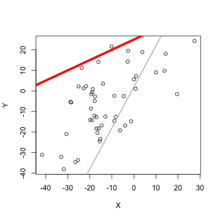
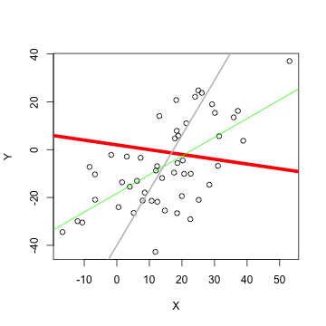

## Start with creating data ... 
We learn that Lineair Regression Line for the data with certain values of intercept and slope has got the lowest standard deviation with data (Y,X), where Y is a set N response variables and X is a set N predictor. With the Shine app, we will find it visually. Start with set number predictor variables to plot (Y,X) :


```
## NULL
```
It keeps until we update (Y,X) with new random values. See next slide more about a line...

--- .class #id 

## ... and line
Before finding Lineair Regression Line, a red Line is drawn with slope and intercept from sliders. With sliders we change values of slope and intercept, so we redraw red line. In the plot example, the line has got intercept=5 and slope=0.3.

At the Shiny app, we can read the standard deviation SD of our line below Plot window.
Be aware that changing values are not smooth or that it is complex to adjust two value, so it may not easy to find lowest standard deviation value.
Then go to next slide ...

--- .class #id 

## Help for searching lowest standard deviation
To find Lineair Regression Line, we have to got lowest SD globally, not locally.
It is not easy to estimate visually. So there is Help is at the Shiny app: it "remembers" a lowest SD we found so far and it draws corresponding grey line.

So if we are sure there is no more minimum, then we can draw line by going back to last found lowest SD. See next slide about a result...

--- .class #id 

## Confirm our result
When we are sure we create line with lowest SD value, then we compare our line with Linear Regression Line visually by checking Yes to show Lineair Regression Line as green line:

We see we found the minimum locally, since grey line and green line are not positioned equally...
So keep on to try the [Shiny app](https://srrussel.shinyapps.io/project/). 
